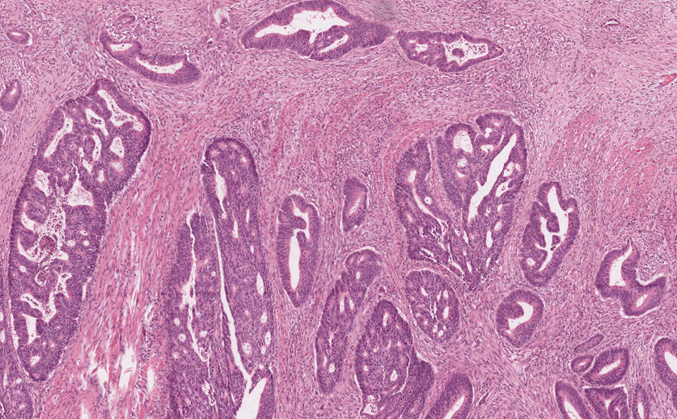
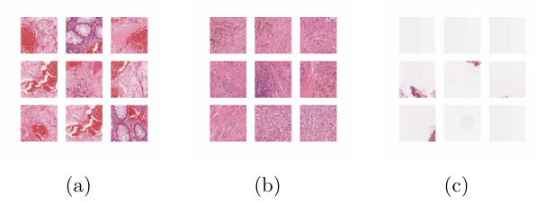
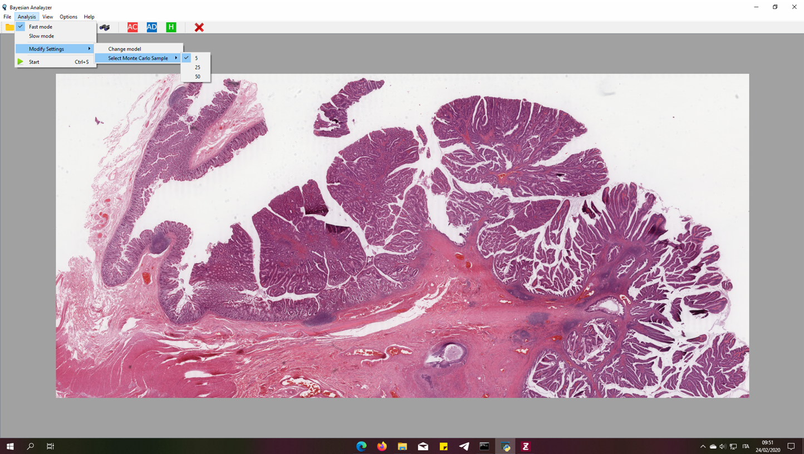
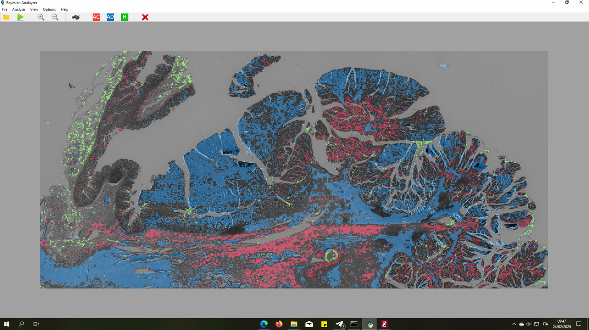
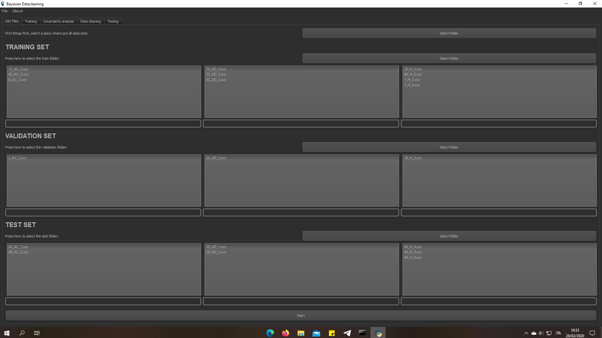

# WSI Analysis — Bayesian Framework for Histopathological Image Analysis

> **Thesis**: *"Applicazione di reti bayesiane all'analisi automatica di immagini istopatologiche"*  
> **Author**: Piero Policastro — Politecnico di Torino, Ingegneria Biomedica, A.Y. 2019–2020  
> **Link PDF**: https://webthesis.biblio.polito.it/13803/
---


## Overview

This toolkit applies **Bayesian deep learning** to the automatic analysis of colorectal histopathological whole-slide images (WSIs).




The key contribution over classical CNNs is the ability to **quantify prediction uncertainty**, enabling the system to signal when a classification is unreliable — a critical property in clinical decision support.

Two uncertainty components are estimated via **Monte Carlo Dropout**:

| Uncertainty | Source | Meaning |
|---|---|---|
| **Aleatoric** | Noise in the data | Irreducible, related to image quality / ambiguous tissue |
| **Epistemic** | Model limitations | Reducible with more or better training data |

The framework implements two distinct Bayesian architectures and exposes them through two PyQt5 graphical applications.

---

## Scientific Background

### Why Bayesian Networks?

Classical neural networks produce deterministic predictions — they assign a class label with no measure of confidence. Bayesian CNNs treat weights as **probability distributions** rather than fixed values, so running inference multiple times on the same input yields a distribution over predictions.

The posterior is approximated via two approaches:

1. **KL Divergence** (Variational Inference) — uses `Conv2DFlipout` and `DenseFlipout` layers from `tensorflow_probability`. Theoretically rigorous but computationally expensive and harder to converge.
2. **Monte Carlo Dropout** (Gal & Ghahramani, 2015) — keeps `Dropout` active at inference time. Mathematically equivalent to a Bayesian approximation with Gaussian weight priors. Faster and more stable.

> Gal & Ghahramani demonstrated that applying dropout before every layer is mathematically equivalent to a Bayesian system with Gaussian weight distributions.

### Dataset

The dataset consists of colorectal tissue WSIs from 27 patients (9 per class) provided by the **University of Leeds Virtual Pathology** repository.

**Three tissue classes:**

| Label | Description |
|---|---|
| `AC` | Adenocarcinoma — malignant epithelial tumor |
| `AD` | Adenoma — benign glandular lesion |
| `H` | Healthy colorectal tissue |

**Tile extraction** was performed at maximum resolution (level 0) using a 256×256 px sliding window without overlap. Images were then downscaled to 64×64 px for training, which yielded equivalent accuracy at significantly lower computational cost.




**Final dataset composition:**

| Set | Samples per class | Total |
|---|---|---|
| Train | 15 000 | 45 000 |
| Validation | 6 400 | 19 200 |
| Test | 2 700 | 8 100 |

Splits were constructed **patient-wise** (no patient appears in more than one set) to prevent data leakage.

### Model Architecture (Monte Carlo Dropout)

The backbone is a custom CNN with dropout applied at every stage (active at inference for MC sampling):

**Convolutional blocks** (×5, each = Conv → BN → ReLU → Conv → BN → ReLU → MaxPool → Dropout):

| Block | Filters | Kernel | Pooling | Dropout |
|---|---|---|---|---|
| 1 | 16 | 6×6 | ✓ | 0.15 |
| 2 | 32 | 6×6 | ✓ | 0.25 |
| 3 | 64 | 6×6 | ✓ | 0.25 |
| 4 | 128 | 4×4 | ✓ | 0.25 |
| 5 | 256 | 4×4 | ✗ | 0.30 |
| 6 | 1024 | 3×3 | ✓ | — |

**Dense head** (after Flatten):

| Layer | Units | Dropout |
|---|---|---|
| Dense 1 | 1024 | 0.35 |
| Dense 2 | 364 | 0.25 |
| Dense 3 | 256 | — |
| Output | 3 | Softmax |

Input: 64×64×3 RGB. Activation: ReLU throughout. Loss: Categorical Cross-Entropy. Optimizer: Adadelta.

### Uncertainty Formulas

For each tile, the model is run **N times** (Monte Carlo samples). Let xᵢ be the softmax output of run *i*:

```
Epistemic = (1/N) Σ xᵢ² − [(1/N) Σ xᵢ]²

Aleatoric  = (1/N) Σ xᵢ(1 − xᵢ)

Total      = Epistemic + Aleatoric
```

### Results Summary

**Baseline dropout model (full dataset):**

| Set | Accuracy |
|---|---|
| Train | 86.3% |
| Validation | 73.2% |
| Test | 68.1% |

**After manual data cleaning + data augmentation:**

| Set | Accuracy |
|---|---|
| Train | 79.7% |
| Validation | 77.1% |
| Test | **76.1%** |

**After automatic Bayesian data cleaning (New threshold) + data augmentation:**

| Set | Accuracy |
|---|---|
| Train | 89.3% |
| Validation | 85.7% |
| Test | **79.3%** |

> The combination of Bayesian data cleaning and data augmentation yielded an **~11% improvement** on the test set over the baseline.

### Data Cleaning via Uncertainty

The uncertainty histogram of any dataset is **bimodal** — tiles with correct predictions cluster near 0, while noisy or ambiguous tiles cluster near 0.5. Two automatic thresholding strategies were implemented:

- **Otsu threshold** (T₁): maximises inter-class variance on the uncertainty histogram. Aggressive — removes ~60% of tiles. Improves in-distribution accuracy but hurts generalisation.
- **New threshold** (T₂): starts from T₁, finds the next peak in the histogram, then locates the point of maximum variation in [T₁, peak]. More conservative — retains ~67% of tiles with a more balanced class distribution.

Tiles with uncertainty **below** the selected threshold are kept; the rest are discarded.

---

## Repository Structure

```
WSI_analysis/
├── ui_pyqt5.py               # Main WSI analysis GUI (entry point 1)
├── ui_dataclean.py           # Data cleaning & training GUI (entry point 2)
├── multi_processing_analysis.py  # Tile extraction from .svs files
├── Classification.py         # Model inference + uncertainty maps
├── DropOut.py                # MC-Dropout CNN training class
├── Kl.py                     # KL-divergence Bayesian model training
├── keras_kl.py               # Additional Bayesian architecture support
├── uncertainty_analysis.py   # Otsu/New threshold & dataset reduction
├── DatasetCreation.py        # TFRecord creation utility
├── progress_bar.py           # Qt progress dialog helper
├── test_widget.py            # Confusion matrix widget
├── deepzoom/
│   └── deepzoom_server.py    # Local Flask-based DeepZoom viewer
├── Model_1_85aug.h5          # Pre-trained model (85% aug, dropout)
├── dictionary_5_js.txt       # Example uncertainty dictionary (MC=5)
├── new_train_js.txt          # Example training set JSON
└── new_val_js.txt            # Example validation set JSON
```

---

## Requirements

```bash
pip install pyqt5 tensorflow openslide-python pillow numpy scipy \
            scikit-learn matplotlib seaborn flask pandas
```

> **TensorFlow compatibility note**: This codebase targets TF ≤ 2.15 on Windows.  
> For TF ≥ 2.16 (Keras 3), replace `from tensorflow.keras` imports with `from keras`.  
> The KL model additionally requires `tensorflow-probability`.
>
> **Windows DLL note**: TF 2.21+ may fail with a DLL init error on Windows.  
> The recommended stable combination is **Python 3.10 + tensorflow-cpu==2.15.0**.

---

## Usage

### 1. WSI Analysis GUI

```bash
python ui_pyqt5.py
```




**Workflow:**
1. **File → Select SVS** — opens a `.svs` file; a thumbnail is generated immediately and tiles are created in the background across all available CPU threads.
2. **Analysis → Start** (or `Ctrl+R`) — runs the Bayesian classifier. A progress bar tracks epoch completion.
3. **View** menu — inspect results per class (AC / AD / H) or view uncertainty maps (total / aleatoric / epistemic).
4. **Options → Deep Zoom Viewer** (or `Ctrl+D`) — launches a local Flask server and opens the slide at full resolution in the browser via OpenSeadragon.

**Output files** (saved in the working directory under `result/`):

| File | Content |
|---|---|
| `Pred_class.png` | All-class overlay on grayscale thumbnail |
| `AC.png`, `AD.png`, `H.png` | Single-class overlays |
| `result/uncertainty/tot.png` | Total uncertainty map |
| `result/uncertainty/ale.png` | Aleatoric uncertainty map |
| `result/uncertainty/epi.png` | Epistemic uncertainty map |
| `dictionary_monte_{N}.txt` | JSON with per-tile path, class, epi, ale values |

**JSON record format (analysis):**
```json
{
  "100": {
    "im_path": "C:/…/tile_100_3_15.png",
    "shape_x": 64,
    "shape_y": 64,
    "col": 3,
    "row": 15,
    "class": "AC",
    "epi": 0.1828,
    "ale": 0.3624
  }
}
```



### 2. Data Cleaning & Training GUI

```bash
python ui_dataclean.py
```



The interface is organised in five tabs:

| Tab | Purpose |
|---|---|
| **Get Tiles** | Select `.svs` folders (one per class: `AC`, `AD`, `H`) and extract tiles for train / val / test |
| **Training** | Choose model (Dropout or KL), set epochs, batch size, data augmentation; live per-batch accuracy stream |
| **Uncertainty Analysis** | Classify a set with the trained model; view epistemic, aleatoric and total uncertainty histograms |
| **Data Cleaning** | Select Otsu / New / Manual threshold; preview removed tiles per class (pie chart); export cleaned dataset |
| **Testing** | View overall and per-patient confusion matrices |

**JSON record format (data cleaning, extends analysis format):**
```json
{
  "0": {
    "name": "pz_42_AD_2",
    "true_class": "AD",
    "im_path": "C:/…/train/AD/pz_42_AD_2_tile_0_0_0.png",
    "shape_x": 64,
    "shape_y": 64,
    "col": 0,
    "row": 0,
    "pred_class": "AC",
    "epi": 0.0028,
    "ale": 0.1229
  }
}
```

### 3. DeepZoom Server (standalone)

```bash
python deepzoom/deepzoom_server.py <path/to/slide.svs>
```

Opens a browser tab at `http://127.0.0.1:5000/` with adaptive-resolution tile streaming via **OpenSeadragon**. The right panel shows all Aperio metadata; the left panel shows any associated images embedded in the `.svs` file.

> ⚠️ The file path must **not contain spaces**.

---

## Key Design Decisions

- **Multiprocessing tile extraction**: the number of worker threads is detected automatically from the CPU thread count, so tile creation scales to the available hardware without configuration.
- **Monte Carlo Dropout at inference**: `Dropout` layers are instantiated with `training=True`, keeping them active during prediction. Running N forward passes yields a prediction distribution from which uncertainty is derived analytically.
- **Patient-wise dataset split**: train, validation and test sets are built from disjoint patient groups, preventing any form of patient-level data leakage.
- **Zero-padding for irregular tiles**: tiles at image borders are often smaller than 64×64 px. Zero-padding is applied before inference and the original dimensions are stored in the JSON to correctly reconstruct the overlay masks.

---

## Notes

- All models expect 64×64 RGB input tiles.
- The `DropOut.py` model architecture is recommended over `Kl.py` due to faster training, better convergence and broader library compatibility.
- DeepZoom paths must not contain spaces (Flask server limitation on Windows).
- The repository was developed and tested on a Windows environment with an Intel i7-7700 (8 threads) and tested on Google Colab (NVIDIA Tesla K80) and HPC Polito (NVIDIA Tesla V100).

---

## References

1. Gal, Y. & Ghahramani, Z. — *Dropout as a Bayesian Approximation: Representing Model Uncertainty in Deep Learning*, 2015.
2. Shridhar, K. et al. — *Bayesian Convolutional Neural Networks with Variational Inference*, 2018.
3. Ioffe, S. & Szegedy, C. — *Batch Normalization: Accelerating Deep Network Training by Reducing Internal Covariate Shift*, 2015.
4. Blundell, C. et al. — *Weight Uncertainty in Neural Networks*, 2015.

---

## License

MIT

### General comments to run app on container wsl2
docker run --rm \
    -e DISPLAY=$DISPLAY \
    -v /tmp/.X11-unix:/tmp/.X11-unix \
    uiclean

# To pass a data folder to the container
docker run --rm \
    -e DISPLAY=$DISPLAY \
    -v /tmp/.X11-unix:/tmp/.X11-unix \
    -v "/mnt/c/Users/piero/Documents/Data WSI:/data" \
    uiclean