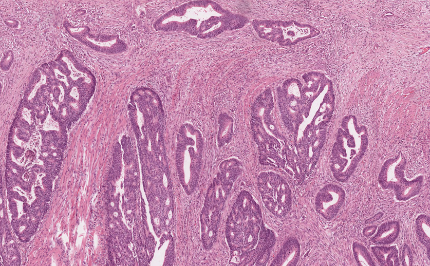
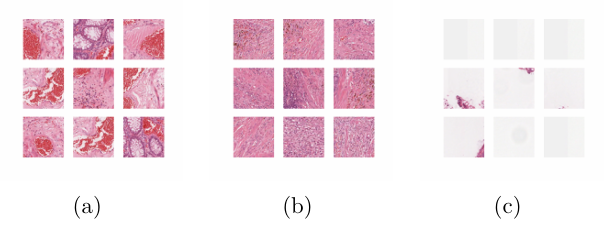
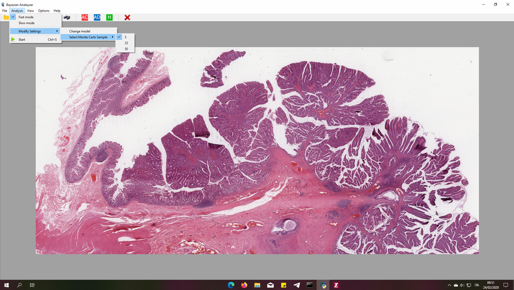
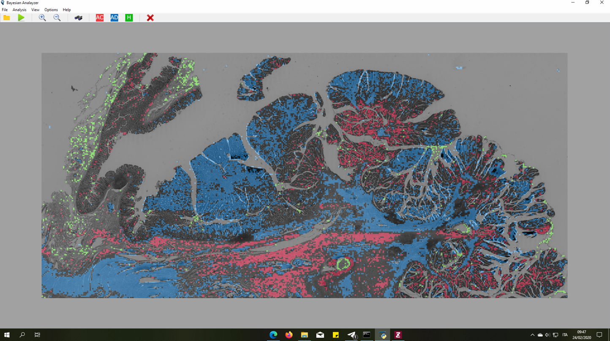
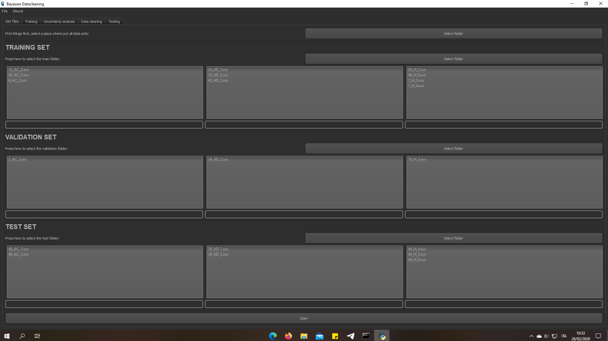

# WSI Analysis — Bayesian Framework for Histopathological Image Analysis

> **Thesis**: *"Applicazione di reti bayesiane all'analisi automatica di immagini istopatologiche"*  
> **Author**: Piero Policastro — Politecnico di Torino, Ingegneria Biomedica, A.Y. 2019–2020  
> **PDF**: [webthesis.biblio.polito.it/13803](https://webthesis.biblio.polito.it/13803/)

---

## Overview

This toolkit applies **Bayesian deep learning** to the automatic analysis of colorectal histopathological whole-slide images (WSIs).



The key contribution over classical CNNs is the ability to **quantify prediction uncertainty**, enabling the system to signal when a classification is unreliable — a critical property in clinical decision support.

Two uncertainty components are estimated via **Monte Carlo Dropout**:

| | Type | Source | Meaning | Reducible? |
|---|---|---|---|---|
| 🎲 | **Aleatoric** | Noise intrinsic to the data *(from Latin **alea**: dice)* | Image artifacts, sensor noise, ambiguous tissue morphology, inter-annotator disagreement | ❌ No — irreducible; inherent to reality |
| 🧠 | **Epistemic** | Model's lack of knowledge *(from Greek **episteme**: knowledge)* | Rare classes, unseen scanners, out-of-distribution samples | ✅ Yes — reducible with more diverse training data |

The framework implements two distinct Bayesian architectures, exposed through two PyQt5 graphical applications.

---

## Scientific Background

### Why Bayesian Networks?

Classical neural networks produce deterministic predictions — they assign a class label with no measure of confidence. Bayesian CNNs treat weights as **probability distributions** rather than fixed values, so running inference multiple times on the same input yields a distribution over predictions.

The posterior is approximated via two approaches:

1. **KL Divergence** (Variational Inference) — uses `Conv2DFlipout` and `DenseFlipout` layers from `tensorflow_probability`. Theoretically rigorous but computationally expensive and harder to converge.
2. **Monte Carlo Dropout** (Gal & Ghahramani, 2015) — keeps `Dropout` active at inference time. Mathematically equivalent to a Bayesian approximation with Gaussian weight priors. Faster and more stable.

> Gal & Ghahramani demonstrated that applying dropout before every weight layer is mathematically equivalent to a Bayesian system with Gaussian weight distributions.

### Dataset

The dataset consists of colorectal tissue WSIs from 27 patients (9 per class), provided by the **University of Leeds Virtual Pathology** repository.

**Three tissue classes:**

| Label | Description |
|---|---|
| `AC` | Adenocarcinoma — malignant epithelial tumour |
| `AD` | Adenoma — benign glandular lesion |
| `H` | Healthy colorectal tissue |

**Tile extraction** was performed at maximum resolution (level 0) using a 256×256 px sliding window without overlap. Images were then downscaled to 64×64 px for training, yielding equivalent accuracy at significantly lower computational cost.



**Final dataset composition:**

| Split | Samples per class | Total |
|---|---|---|
| Train | 15 000 | 45 000 |
| Validation | 6 400 | 19 200 |
| Test | 2 700 | 8 100 |

Splits were constructed **patient-wise** — no patient appears in more than one set — to prevent data leakage.

### Model Architecture (Monte Carlo Dropout)

The backbone is a custom CNN with dropout applied at every stage (active at inference for MC sampling).

**Convolutional blocks** (×5, each = Conv → BN → ReLU → Conv → BN → ReLU → MaxPool → Dropout):

| Block | Filters | Kernel | Pooling | Dropout |
|---|---|---|---|---|
| 1 | 16 | 6×6 | ✓ | 0.15 |
| 2 | 32 | 6×6 | ✓ | 0.25 |
| 3 | 64 | 6×6 | ✓ | 0.25 |
| 4 | 128 | 4×4 | ✓ | 0.25 |
| 5 | 256 | 4×4 | ✗ | 0.30 |
| 6 | 1024 | 3×3 | ✓ | — |

**Dense head** (after Flatten):

| Layer | Units | Dropout |
|---|---|---|
| Dense 1 | 1024 | 0.35 |
| Dense 2 | 364 | 0.25 |
| Dense 3 | 256 | — |
| Output | 3 | Softmax |

Input: 64×64×3 RGB. Activation: ReLU throughout. Loss: Categorical Cross-Entropy. Optimizer: Adadelta.

### Uncertainty Formulas

For each tile, the model is run **N times** (Monte Carlo samples). Let xᵢ be the softmax output of run *i*:

```
Epistemic = (1/N) Σ xᵢ² − [(1/N) Σ xᵢ]²

Aleatoric  = (1/N) Σ xᵢ(1 − xᵢ)

Total      = Epistemic + Aleatoric
```

### Results

**Baseline dropout model (full dataset):**

| Split | Accuracy |
|---|---|
| Train | 86.3% |
| Validation | 73.2% |
| Test | 68.1% |

**After manual data cleaning + data augmentation:**

| Split | Accuracy |
|---|---|
| Train | 79.7% |
| Validation | 77.1% |
| Test | **76.1%** |

**After automatic Bayesian data cleaning (New threshold) + data augmentation:**

| Split | Accuracy |
|---|---|
| Train | 89.3% |
| Validation | 85.7% |
| Test | **79.3%** |

> The combination of Bayesian data cleaning and data augmentation yielded an **~11 percentage point improvement** on the test set over the baseline.

### Data Cleaning via Uncertainty

The uncertainty histogram of any dataset is **bimodal** — tiles with correct predictions cluster near 0, while noisy or ambiguous tiles cluster near 0.5. Two automatic thresholding strategies are implemented:

- **Otsu threshold** (T₁): maximises inter-class variance on the uncertainty histogram. Aggressive — removes ~60% of tiles. Improves in-distribution accuracy but can hurt generalisation.
- **New threshold** (T₂): starts from T₁, finds the next peak in the histogram, then locates the point of maximum variation in [T₁, peak]. More conservative — retains ~67% of tiles with a more balanced class distribution.

Tiles with uncertainty **below** the selected threshold are kept; the rest are discarded.

---

## Repository Structure

The codebase is organised into two real Python packages — `models/` (Bayesian model classes) and `src/` (core logic, widgets, config) — each with an `__init__.py` and re-exports. Live code is snake_case; legacy TF1 / Colab experiments live under `archive/`.

```
WSI_analysis/
├── archive/                          # Legacy Colab-era code + 14 MB of sample tile dicts
│   ├── dataset_creation.py            #   TF1 5-class TFRecord pipeline (dead)
│   ├── dictionary_5_js.txt            #   ~1 MB sample tile dict (MC=5)
│   ├── new_train_js.txt               #   9.5 MB sample tile dict (train)
│   ├── new_val_js.txt                 #   4.0 MB sample tile dict (val)
│   └── original_requirements.txt      #   2019 TF 1.15 requirements
├── data/                             # Real patient WSI datasets (per-patient subfolders)
├── docs/                             # BUG_REPORT.md, PROJECT_MAP.md
├── icons/                            # 12 PyQt5 GUI icon assets (.ico / .png)
├── img/                              # Thesis figures + stray UI assets
├── models/                           # ✓ Bayesian model package
│   ├── __init__.py                    #   re-exports BayesianDropoutCNN, ModelKl, BayesianModel
│   ├── base.py                        #   BayesianModel Protocol (unified ctor + train() + start_train())
│   ├── drop_out.py                    #   MC-Dropout CNN — BayesianDropoutCNN
│   └── kl.py                          #   KL-Flipout CNN — ModelKl (tensorflow_probability)
├── src/                              # ✓ Core logic package
│   ├── __init__.py                    #   re-exports CLASS_NAMES, N_CLASSES, INPUT_SHAPE
│   ├── config.py                      #   single source of truth for class names / shape
│   ├── classification.py              #   Classification — tile inference + uncertainty maps
│   ├── multi_processing_analysis.py   #   StartAnalysis — OpenSlide tiling (moved from root)
│   ├── uncertainty_analysis.py        #   Th — Otsu + New-threshold data cleaning
│   ├── performance_widget.py          #   PerformanceTab — confusion matrix widget (renamed from test_widget.py)
│   ├── progress_bar.py                #   Actions — Qt progress helper
│   ├── qt_workers.py                  #   Worker / WorkerSignals / WorkerLong helpers
│   └── deepzoom/                      #   Flask DeepZoom sub-app
│       ├── static/                    #     OpenSeadragon + jQuery
│       ├── templates/
│       └── deepzoom_server.py
├── styles/                           # Qt stylesheets (stile.txt, stileor.css)
├── test/                             # empty (scratch scripts cleaned out)
├── ui_dataclean.py                   # Entry point 2 — Data cleaning & training GUI (5 tabs)
├── ui_pyqt5.py                       # Entry point 1 — Main WSI analysis GUI
├── pyproject.toml                    # uv / PEP 621 — single source of dependencies
├── uv.lock                           # uv lockfile (cross-platform: Windows + Linux)
├── Dockerfile                        # Multi-stage container (python:3.10-slim)
├── docker-compose.yaml                # 2 services, X11 forwarding for PyQt5 on WSL2
├── .python-version                   # 3.10 (pyenv / uv)
└── README.md
```

Both entry points must be run with `CWD = repo root` so the `models.` and `src.` imports resolve.

---

## Requirements

Dependencies are managed with [**uv**](https://docs.astral.sh/uv/) and pinned in `pyproject.toml`; the lockfile `uv.lock` guarantees reproducible installs across Windows (native dev) and Linux (Docker). `requirements.txt` has been **removed** — `pyproject.toml` is now the single source of truth.

> Python **3.10** (`requires-python = ">=3.10,<3.12"`).

### Install with uv (recommended)

```bash
# 1. Install uv (one-time)
#    macOS / Linux:
curl -LsSf https://astral.sh/uv/install.sh | sh
#    Windows PowerShell:
powershell -ExecutionPolicy ByPass -c "irm https://astral.sh/uv/install.ps1 | iex"

# 2. From the repo root, create the venv and install every pinned dep:
uv sync
```

`uv sync` reads `pyproject.toml` + `uv.lock`, creates `.venv/` with the right Python 3.10, and installs the locked resolution for the current platform. The `[tool.uv] environments` block pins both `win32` and `linux` in `uv.lock`, so the same lockfile works inside the Docker container.

Run any script through the project environment with:

```bash
uv run python ui_pyqt5.py
uv run python ui_dataclean.py
uv run python -m src.deepzoom.deepzoom_server <slide.svs>
```

### Install with pip (fallback)

```bash
python -m venv .venv
# Windows:  .venv\Scripts\activate
# Linux:    source .venv/bin/activate
pip install .
```

### Key packages

| Package | Version | Role |
|---|---|---|
| `tensorflow` | 2.15.0 | Model training and inference |
| `keras` | 2.15.0 | High-level neural network API (bundled with TF 2.15) |
| `tensorflow-probability` | 0.23.0 | KL-divergence Flipout layers (used by `models/kl.py`) |
| `numpy` | 1.26.4 | Numerical computation |
| `PyQt5` | 5.15.10 | GUI framework |
| `openslide-python` | 1.4.3 | WSI file reading |
| `openslide-bin` | 4.0.0.13 | OpenSlide native binaries |
| `scikit-learn` | >=1.4.1 | Metrics and data utilities |
| `matplotlib` / `seaborn` | 3.8.4 / 0.13.0 | Plotting |
| `pandas` | 2.2.0 | Data handling |
| `scipy` | 1.12.0 | Otsu thresholding and signal processing |
| `flask` | >=3.0.0 | DeepZoom server (`src/deepzoom/deepzoom_server.py`) |
| `Pillow` | 10.2.0 | Image I/O |

> `tensorflow-probability` and `flask` are now first-class dependencies (they were previously optional). The Linux-only `tensorflow-io-gcs-filesystem==0.37.1` is conditionally pinned via a `sys_platform != 'win32'` marker.

---

## Usage

### 1. WSI Analysis GUI

```bash
uv run python ui_pyqt5.py
# or without uv:
python ui_pyqt5.py
```



**Workflow:**
1. **File → Select SVS** — opens a `.svs` file; a thumbnail is generated immediately and tiles are extracted in the background using all available CPU threads.
2. **Analysis → Start** (or `Ctrl+R`) — runs the Bayesian classifier. A progress bar tracks completion.
3. **View** menu — inspect results per class (`AC` / `AD` / `H`) or view uncertainty maps (total / aleatoric / epistemic).
4. **Options → Deep Zoom Viewer** (or `Ctrl+D`) — launches a local Flask server and opens the slide at full resolution in the browser via OpenSeadragon.

**Output files** (saved under `result/` in the working directory):

| File | Content |
|---|---|
| `Pred_class.png` | All-class overlay on greyscale thumbnail |
| `AC.png`, `AD.png`, `H.png` | Single-class overlays |
| `result/uncertainty/tot.png` | Total uncertainty map |
| `result/uncertainty/ale.png` | Aleatoric uncertainty map |
| `result/uncertainty/epi.png` | Epistemic uncertainty map |
| `dictionary_monte_{N}.txt` | JSON with per-tile path, class, epistemic and aleatoric values |

**JSON record format (analysis):**
```json
{
  "100": {
    "im_path": "C:/…/tile_100_3_15.png",
    "shape_x": 64,
    "shape_y": 64,
    "col": 3,
    "row": 15,
    "class": "AC",
    "epi": 0.1828,
    "ale": 0.3624
  }
}
```



### 2. Data Cleaning & Training GUI

```bash
uv run python ui_dataclean.py
# or without uv:
python ui_dataclean.py
```



The interface is organised in five tabs:

| Tab | Purpose |
|---|---|
| **Get Tiles** | Select `.svs` folders (one per class: `AC`, `AD`, `H`) and extract tiles for train / val / test |
| **Training** | Choose model (Dropout or KL), set epochs, batch size, and data augmentation; live per-batch accuracy stream |
| **Uncertainty Analysis** | Classify a set with the trained model; view epistemic, aleatoric, and total uncertainty histograms |
| **Data Cleaning** | Select Otsu / New / Manual threshold; preview removed tiles per class (pie chart); export cleaned dataset |
| **Testing** | View overall and per-patient confusion matrices |

**JSON record format (data cleaning, extends analysis format):**
```json
{
  "0": {
    "name": "pz_42_AD_2",
    "true_class": "AD",
    "im_path": "C:/…/train/AD/pz_42_AD_2_tile_0_0_0.png",
    "shape_x": 64,
    "shape_y": 64,
    "col": 0,
    "row": 0,
    "pred_class": "AC",
    "epi": 0.0028,
    "ale": 0.1229
  }
}
```

### 3. DeepZoom Server

The Flask DeepZoom viewer can be launched three ways:

**Native (Windows or WSL2):**

```bash
uv run python -m src.deepzoom.deepzoom_server <path/to/slide.svs>
# or without uv:
python -m src.deepzoom.deepzoom_server <path/to/slide.svs>
```

The server binds to `127.0.0.1:5000` by default. Open `http://127.0.0.1:5000/` in any browser — you get adaptive-resolution tile streaming via **OpenSeadragon**, the right panel shows all Aperio metadata, the left panel any associated images embedded in the `.svs` file.

Override host/port with `--listen` / `--port` flags or `DEEPZOOM_HOST` / `DEEPZOOM_PORT` env vars:

```bash
DEEPZOOM_HOST=0.0.0.0 DEEPZOOM_PORT=8000 python -m src.deepzoom.deepzoom_server slide.svs
# → http://localhost:8000/
```

**From the Bayesian Analyzer GUI (Windows or WSL2):**

`ui_pyqt5.py`'s **Options → Deep Zoom Viewer** (or `Ctrl+D`) starts the server as a subprocess and opens the default browser. The browser-target URL is `http://127.0.0.1:5000/` unless you override it with `DEEPZOOM_BROWSER_HOST` / `DEEPZOOM_BROWSER_PORT` env vars (useful when remapping the Docker published port).

**Standalone Docker container (WSL2):**

A `wsi-deepzoom` service in `docker-compose.yaml` runs the server inside the container with `DEEPZOOM_HOST=0.0.0.0` and publishes port `5000` to the Windows host. From a Windows browser, point at `http://localhost:5000/`:

```bash
# From inside WSL2, mount the .svs under /data and pass the in-container path
docker compose run --rm wsi-deepzoom /data/10002_AC_2/slide.svs
# Then open http://localhost:5000/ in any Windows browser.
```

> ⚠️ The `.svs` file path must **not contain spaces** (Flask limitation on Windows). For the Docker service this is irrelevant — the in-container path is `/data/…`.

---

## Docker

A `Dockerfile` is included in the repository. The container supports X11 forwarding for the PyQt5 GUI when running under WSL2.

The `Dockerfile` is a multi-stage build: a **builder** stage pulls in `uv` (`ghcr.io/astral-sh/uv`) and runs `uv sync --frozen --no-install-project --no-dev` against `pyproject.toml` / `uv.lock`, so the runtime stage picks up the Linux resolution from the cross-platform lockfile without re-resolving. The runtime stage is `python:3.10-slim` plus the Qt/X11 shared libraries, copies the prebuilt `.venv/` from the builder, and runs as a non-root user (`wsi`, uid 1001).

A BuildKit cache mount (`--mount=type=cache,target=/root/.cache/uv`) keeps the uv wheel cache across rebuilds, so code-only edits no longer trigger the ~1 GB TensorFlow wheel re-download. Layer order also matters: `pyproject.toml` + `uv.lock` are copied **before** the source, so filtering one line of `ui_dataclean.py` invalidates only the final `COPY . .` layer.

### Build (one image, two entry points)

```bash
docker compose build
```

Both `docker-compose.yaml` services (`wsi-clean`, `wsi-analysis`) reference the same built image (`wsi-analysis:latest`) and only differ in `command:`. Building once via `docker compose build` produces a single image that both services reuse.

### Run either GUI

```bash
# Data cleaning & training GUI (default CMD)
docker compose up wsi-clean

# Main WSI analysis GUI
docker compose up wsi-analysis
```

### Override the mounted data folder

The hardcoded WSL path is now overrideable via the `WSI_DATA_DIR` environment variable (defaults to `/mnt/c/Users/piero/Documents/Data WSI`):

```bash
WSI_DATA_DIR=/path/to/your/slides docker compose up wsi-clean
```

Inside the container the data is accessible at `/data`. Replace `/path/to/your/slides` with the absolute path to the folder containing your `.svs` files.

### Where the analysis output goes

When you open an `.svs` file (in either GUI, or via `StartAnalysis` in a headless run), the per-slide analysis folder is created **next to the `.svs` file** as `data/<svs_name>_<level>/`, containing `thumbnail/`, the `p_*` tile subfolders, the `result/` overlays and the `dictionary_monte_*.txt` JSON. Inside the default Docker setup this means the output lands in the bind-mounted `/data` folder, so it's immediately visible on the host — no extra volume needed.

If your `.svs` source is read-only (e.g. a NAS share, a mounted DICOM archive), set `WSI_OUTPUT_DIR` to redirect all output to a different location:

```bash
# Native (Windows / WSL2)
WSI_OUTPUT_DIR=/mnt/c/Users/piero/Documents/wsi_output python ui_pyqt5.py

# Docker: uncomment the /output bind-mount in docker-compose.yaml first, then:
WSI_OUTPUT_DIR=/output docker compose up wsi-analysis
```

The same directory layout (`data/<svs_name>_<level>/…`) is created under the override path.

### Apple Silicon / ARM hosts

If you build on an ARM host (Apple M1/M2) and want the amd64 TensorFlow wheel, pin the platform explicitly:

```bash
docker buildx build --platform linux/amd64 -t wsi-analysis .
```

### Bare `docker run` (fallback, no compose)

```bash
docker build -t wsi-analysis .
docker run --rm \
    -e DISPLAY=$DISPLAY \
    -v /tmp/.X11-unix:/tmp/.X11-unix \
    -v "/mnt/c/Users/piero/Documents/Data WSI:/data" \
    wsi-analysis python ui_dataclean.py
```

---

## Key Design Decisions

- **Multiprocessing tile extraction**: the number of worker threads is detected automatically from the CPU thread count, so tile creation scales to available hardware without manual configuration.
- **Monte Carlo Dropout at inference**: `Dropout` layers are instantiated with `training=True`, keeping them active during prediction. Running N forward passes yields a prediction distribution from which uncertainty is derived analytically.
- **Patient-wise dataset split**: train, validation, and test sets are built from disjoint patient groups, preventing any form of patient-level data leakage.
- **Zero-padding for border tiles**: tiles at image borders are often smaller than 64×64 px. Zero-padding is applied before inference and the original dimensions are stored in the JSON to correctly reconstruct the overlay masks.

---

## Notes

- All models expect 64×64 RGB input tiles.
- The `models/drop_out.py` (MC-Dropout) architecture is recommended over `models/kl.py` (KL-Flipout) for faster training, better convergence, and broader library compatibility.
- DeepZoom paths must not contain spaces (Flask limitation on Windows).
- Developed and tested on Windows (Intel i7-7700, 8 threads); also validated on Google Colab (NVIDIA Tesla K80) and HPC Polito (NVIDIA Tesla V100).

---

## References

1. Gal, Y. & Ghahramani, Z. — *Dropout as a Bayesian Approximation: Representing Model Uncertainty in Deep Learning*, 2015.
2. Shridhar, K. et al. — *Bayesian Convolutional Neural Networks with Variational Inference*, 2018.
3. Ioffe, S. & Szegedy, C. — *Batch Normalization: Accelerating Deep Network Training by Reducing Internal Covariate Shift*, 2015.
4. Blundell, C. et al. — *Weight Uncertainty in Neural Networks*, 2015.

---

## License

MIT